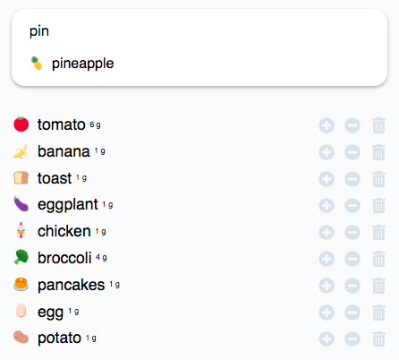

# Frosty
A simple app that keeps track of what's in your fridge. Based on node and react.



# Running your own instance
## Dev
```
yarn install
yarn lerna bootstrap
yarn start
```

The CRA application should automatically open in your browser on port 3000.
You can access the server at the configured port with the default being 8000. Remember that the client served by the server, not CRA!, is a built version. After updating client code you'll need to rebuilt.

You can run tests by using ```yarn test```. This will run all tests in watch mode. If you want to run them once, e.g. in CI environments, set ```CI=true```.

## Production
```
yarn install
yarn lerna bootstrap
yarn lerna build # Not necessary if NODE_ENV=production
node ./server/build/index.js
```

## Config
In order to run your own instance a few environment config variables need to be provided. You can find these below.
```
PORT=8000
FROSTY_URL="http://localhost:8000"
SQLITE_URL="./database.sqlite3"
SENDGRID_KEY=YOUR_SENDGRID_KEY
DEFAULT_EMAIL_FROM=YOUR_DEFAULT_EMAIL_ADDRESS
PASSWORDS_PEPPER=YOUR_PASSWORD_PEPPER
```